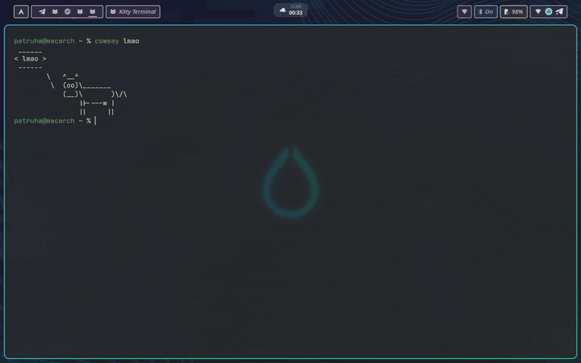

# muglock

**macOS-style FaceID for your Linux lockscreen**


Every line of code in this repo was written by Claude in dialogue with a human.



## What it is

A [quickshell](https://quickshell.org) lockscreen for Hyprland that looks at you
through the webcam, recognizes your face with [howdy](https://github.com/boltgolt/howdy),
plays a chirp and lets you in — or quietly steps aside so you can type your
password.

## Features

- Real `ext-session-lock` lockscreen (`WlSessionLock`), one surface per screen.
- Animated FaceID plaque: pulsing face icon + scanline while scanning, spring
  checkmark and a chirp on success, a calm hint on failure.
- Password fallback via PAM (`PamContext`) — active in every state, always.
- Camera used only on wake, hard-capped by `timeout(1)` (10 s in the UI, SIGKILL
  at 12 s), then released.
- Face scan retries on any keypress after a failure.
- hypridle integration over `qs ipc` — two lines of config.
- Mock and dev modes: full development with no root, no camera, no locking.
- Theme matching a dark-blue hyprlock rice; `JetBrainsMono Nerd Font`.

## Security disclaimer

muglock uses an RGB camera. It can be fooled by a photo of your face. Treat it as
a convenience, not a security boundary. Your password always works.

muglock never touches `/etc/pam.d/*`. The only privileged file it writes is
`/etc/sudoers.d/muglock`, containing exactly one command:

```
<you> ALL=(root) NOPASSWD: /usr/bin/timeout --signal=KILL 12 /usr/bin/howdy compare <you>
```

validated with `visudo -cf` before installation. `timeout` is part of the granted
command because `sudo` cannot forward a signal to its child — without it a hung
`howdy` would keep the camera after muglock gave up on it.

## Install

### AUR (Arch)

```bash
paru -S muglock   # or: yay -S muglock
```

### .deb (Debian/Ubuntu)

Grab `muglock_<version>_all.deb` from
[Releases](https://github.com/petruha/muglock/releases):

```bash
sudo dpkg -i muglock_0.1.0_all.deb
```

`quickshell` and `howdy` are not in apt, so they are not declared as
dependencies — the postinst tells you what is missing and where to get it.

### From source

```bash
git clone https://github.com/petruha/muglock
cd muglock
./install.sh --dry-run   # see exactly what it would do
./install.sh
```

`install.sh` is idempotent. It detects your distro, installs deps where it safely
can, symlinks `shell/` to `~/.config/quickshell/muglock`, writes the sudoers
drop-in, and *prints* (never auto-edits) the remaining manual steps.

### Enroll your face

```bash
sudo howdy add
sudo -n howdy compare "$USER"   # must exit 0 with no password prompt
```

## hypridle integration

Add to `~/.config/hypridle.conf`:

```ini
general {
    lock_cmd        = qs -c muglock ipc call muglock lock
    after_sleep_cmd = qs -c muglock ipc call muglock wake
}
```

`lock_cmd` runs on every `loginctl lock-session` (so also on your idle listener's
`on-timeout`); `after_sleep_cmd` re-scans your face when the machine comes back
from suspend.

The IPC contract:

| Command | Effect |
| --- | --- |
| `qs -c muglock ipc call muglock lock` | Engage the lock and start a face scan |
| `qs -c muglock ipc call muglock wake` | Restart the face scan on an already-locked screen |

Run the shell itself with `qs -c muglock` (from your Hyprland autostart).

## Mock and dev modes

Two environment variables make the whole thing developable on any machine, with
zero privileges and no risk of locking yourself out:

| Variable | Values | Effect |
| --- | --- | --- |
| `MUGLOCK_MOCK` | `ok`, `fail`, `slow` | Replaces `howdy compare` with `scripts/howdy-stub.sh`: match after 1.2 s / no match after 1.5 s / 15 s hang to exercise the 10 s timeout. **Only honoured together with `MUGLOCK_DEV=1`** — otherwise a stray `MUGLOCK_MOCK` in your real session would unlock the screen with no camera involved |
| `MUGLOCK_DEV` | `1` | Renders the lockscreen in an ordinary floating window instead of engaging the session lock, and unlocks `MUGLOCK_MOCK` |

```bash
# The full lockscreen in a window, faking a successful scan:
MUGLOCK_DEV=1 MUGLOCK_MOCK=ok qs -p shell
qs -p shell ipc call muglock wake

# Individual components:
qs -p shell/DevPreview.qml    # background, clock, date, password pill
qs -p shell/DevPlaque.qml     # plaque animations cycling through all phases
MUGLOCK_DEV=1 MUGLOCK_MOCK=ok qs -p shell/DevScanner.qml   # scanner logic, prints transitions
```

Every unit ships a runnable check under `scripts/`:

```bash
scripts/test-chirp.sh      # the chirp asset is a short vorbis file
scripts/test-stub.sh       # mock backend exit codes
scripts/test-qml-loads.sh shell/DevPreview.qml
scripts/test-scanner.sh    # succeeded / no-match / timeout transitions
scripts/test-ipc.sh        # lock + wake over qs ipc
scripts/test-install.sh    # install.sh dry-run contract
scripts/test-deb.sh        # .deb contents and PKGBUILD sanity
```

## Recovery

If quickshell crashes while the session is locked, Hyprland keeps the session
hidden (a black screen, not your desktop) — that is the session-lock protocol
doing its job, not muglock hanging. To get back in:

1. Switch to a tty: <kbd>Ctrl</kbd>+<kbd>Alt</kbd>+<kbd>F3</kbd>, log in.
2. Then either:

```bash
hyprlock                  # a second lockscreen you can actually type into
loginctl unlock-session   # drop the lock outright
```

Keep `hyprlock` installed. Your password works in muglock in every state, so this
path is for crashes only.

## Uninstall

```bash
rm ~/.config/quickshell/muglock
sudo rm /etc/sudoers.d/muglock
# and remove the two muglock lines from general{} in ~/.config/hypridle.conf
paru -R muglock        # or: sudo dpkg -r muglock
```

Nothing else was modified — no PAM files, no compositor config.

## License

MIT © 2026 petruha. See [LICENSE](LICENSE).
