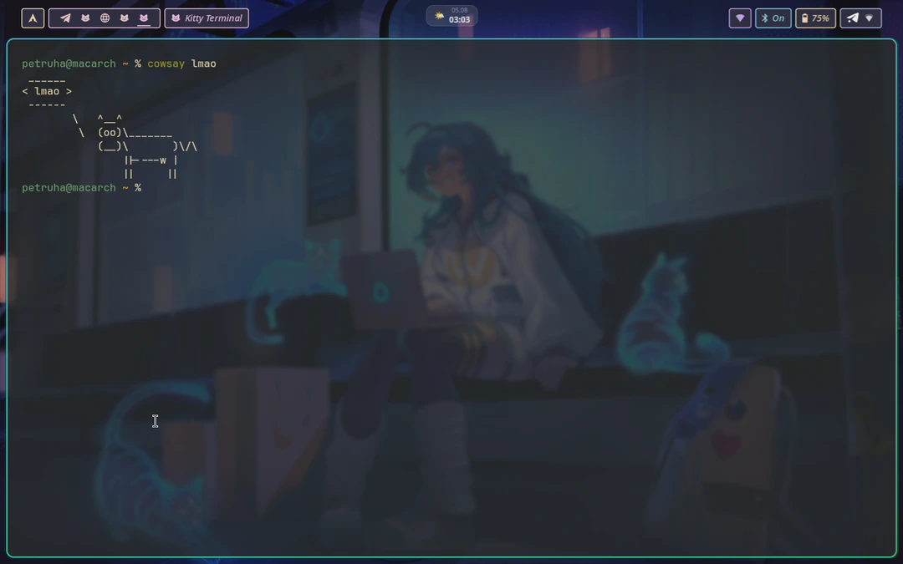

# muglock

**macOS-style FaceID for your Linux lockscreen**

[](#model-credits)
[](https://github.com/Petyok/muglock/releases)
[](LICENSE)

> ⚠️ This project is 100% vibe-coded slop — see [Model credits](#model-credits)
> for who to blame; not a single line was written by a human. It has — and will
> keep having — stupid bugs LLMs can't see. Your password always works; use at
> your own risk.



## What it is

A [quickshell](https://quickshell.org) lockscreen for Hyprland that looks at you
through the webcam, recognizes your face with
[howdy-next](https://codeberg.org/nathawat/howdy-next),
plays a chirp and lets you in — or quietly steps aside so you can type your
password.

## Features

- Real `ext-session-lock` lockscreen (`WlSessionLock`), one surface per screen.
- Animated FaceID plaque: pulsing face icon + scanline while scanning, spring
  checkmark and a chirp on success, a calm hint on failure.
- Password fallback via PAM (`PamContext`) — active in every state, always.
- Speaker icon by the date: muted or not, click to toggle — the chirp is only
  as quiet as you left the desktop.
- Honest failure messages: "didn't recognize you" is only ever shown when howdy
  really looked and did not match. A busy camera, a dark room or a broken config
  each say so, because sending someone to fix the lighting for a dead device is
  worse than saying nothing.
- Camera used only on wake, then released. Native howdy-next removes Python
  startup from the scan path. The stop ladder runs inside-out: howdy-next's
   configured scan timeout plus camera/model startup headroom → `timeout(1)`
   SIGTERM (11 s) → its SIGKILL escalation (13 s) → the UI's last-resort cap
   (14 s). Keep `[video] timeout` at 8 seconds or less to leave startup headroom.
   SIGTERM lets OpenCV release the device; a SIGKILL mid-capture is what leaves a
   webcam driver wedged.
- Rescan on demand: Enter on an empty password field, a click on the plaque,
  or an IPC `wake` (lid open). Typing never restarts the camera.
- Keyboard layout chip in the password pill — loud when it's not EN, because a
  hidden-echo password in the wrong layout is how "my password stopped working".
- Seamless unlock: the lock dissolves into the live desktop (overlay-layer
  handoff), and the animation can never hold an authenticated unlock hostage.
- hypridle integration over `qs ipc` — two lines of config.
- Mock and dev modes: full development with no root, no camera, no locking.
- Theme matching a dark-blue hyprlock rice; `JetBrainsMono Nerd Font`.

## Security disclaimer

muglock uses an RGB camera. It can be fooled by a photo of your face. Treat it as
a convenience, not a security boundary. Your password always works.

muglock never touches `/etc/pam.d/*`. The only privileged file it writes is
`/etc/sudoers.d/muglock`, containing exactly one command:

```
<you> ALL=(root) NOPASSWD: /usr/bin/timeout --signal=TERM --kill-after=2 11 /usr/lib/howdy/howdy-compare <you>
```

validated with `visudo -cf` before installation. `timeout` is part of the granted
command because `sudo` cannot forward a signal to its child — without it a hung
`howdy` would keep the camera after muglock gave up on it.

## Install

### Arch

Not on AUR yet — build from the repo's PKGBUILD:

```bash
git clone https://github.com/Petyok/muglock && cd muglock
makepkg -si
```

Install howdy-next 3.x separately, for example with `paru -S howdy-next`, then
enroll a model with `sudo howdy add`.

### .deb (Debian/Ubuntu)

Grab `muglock_<version>_all.deb` from
[Releases](https://github.com/Petyok/muglock/releases):

```bash
sudo dpkg -i muglock_0.2.0_all.deb
```

`quickshell` and `howdy` are not in apt, so they are not declared as
dependencies — the postinst tells you what is missing and where to get it.

### From source

```bash
git clone https://github.com/Petyok/muglock
cd muglock
./install.sh --dry-run   # see exactly what it would do
./install.sh
```

`install.sh` is idempotent. It detects your distro, installs deps where it safely
can, symlinks `shell/` to `~/.config/quickshell/muglock`, writes the sudoers
drop-in, and *prints* (never auto-edits) the remaining manual steps.

### Enroll your face

```bash
sudo howdy add
sudo -n /usr/lib/howdy/howdy-compare "$USER"   # must exit 0 with no password prompt
```

### Migrating from howdy 2.x

Install `howdy-next` 3.x and **re-enroll your face**. howdy-next keeps its models
in its own location and format, so a machine that upgrades arrives with a working
camera and no enrolled face. `howdy-compare` then exits **10** — muglock reports
that as "No face enrolled", because calling it a camera fault is how a perfectly
good webcam ends up looking broken (that is exactly what happened here):

```bash
sudo howdy clear
sudo howdy add
sudo howdy config
```

Review `[video]` settings such as `device_path`, `timeout`, and camera
resolution, plus `[face] sface_threshold`, in `/etc/howdy/config.ini`. Note the
recognition engine changed with 3.x: YuNet plus SFace (ONNX) instead of dlib, so
the match knob is `[face] sface_threshold` (cosine distance) rather than howdy
2.x's `certainty`, and it is worth re-checking `[snapshots] save_failed` — it
writes a photo of your face on every miss.

Do not copy an old 2.x config or model file across. Keep `[video] timeout` at 8
seconds or less so camera and model startup still fit under muglock's 11-second
kernel-side cap; howdy-next ships with 4.

Measured on the reference machine (MacBook Air 2015, FaceTime HD, 1280x720):
**1.88 s** per unlock over five consecutive runs, against 2.9-3.1 s on howdy 2.6.

Verify the native scanner before locking:

```bash
sudo -n /usr/lib/howdy/howdy-compare "$USER"
```

## hypridle integration

Add to `~/.config/hypridle.conf`:

```ini
general {
    lock_cmd        = qs -p ~/.config/quickshell/muglock ipc call muglock lock
    after_sleep_cmd = qs -p ~/.config/quickshell/muglock ipc call muglock wake
}
```

`lock_cmd` runs on every `loginctl lock-session` (so also on your idle listener's
`on-timeout`); `after_sleep_cmd` re-scans your face when the machine comes back
from suspend.

If something in your setup locks the screen while the lid is **closed** — a lid
daemon, for instance — have it call `lockNoScan` instead of `lock`. A closed lid
aims the camera at the keyboard, so a scan there spends seconds of camera time
and always ends on "too dark", displayed to a panel nobody can see.

The IPC contract:

| Command | Effect |
| --- | --- |
| `qs -p ~/.config/quickshell/muglock ipc call muglock lock` | Engage the lock and start a face scan |
| `qs -p ~/.config/quickshell/muglock ipc call muglock lockNoScan` | Engage the lock but skip the scan — for a caller that knows the camera has nothing to look at, e.g. a lid daemon locking a closed laptop. The scan then happens on the next `wake`. |
| `qs -p ~/.config/quickshell/muglock ipc call muglock wake` | Restart the face scan on an already-locked screen |

Run the shell itself with `qs -p ~/.config/quickshell/muglock` (from your Hyprland autostart).

## Mock and dev modes

Two environment variables make the whole thing developable on any machine, with
zero privileges and no risk of locking yourself out:

| Variable | Values | Effect |
| --- | --- | --- |
| `MUGLOCK_MOCK` | `ok`, `fail`, `nomodel`, `busy`, `dark`, `capped`, `slow` | Replaces the native howdy-next compare helper with `scripts/howdy-stub.sh`, which preserves the scanner test contract: match (0) / scan window expired without a match (11) / no face enrolled (10) / camera unavailable (1) / all frames too dark (13) / outer timeout (124) / a hang that outlives the UI cap. **Only honoured together with `MUGLOCK_DEV=1`** — otherwise a stray `MUGLOCK_MOCK` in your real session would unlock the screen with no camera involved |
| `MUGLOCK_DEV` | `1` | Renders the lockscreen in an ordinary floating window instead of engaging the session lock, and unlocks `MUGLOCK_MOCK` |

```bash
# The full lockscreen in a window, faking a successful scan:
MUGLOCK_DEV=1 MUGLOCK_MOCK=ok qs -p shell
qs -p shell ipc call muglock wake

# Individual components:
qs -p shell/DevPreview.qml    # background, clock, date, password pill
qs -p shell/DevPlaque.qml     # plaque animations cycling through all phases
MUGLOCK_DEV=1 MUGLOCK_MOCK=ok qs -p shell/DevScanner.qml   # scanner logic, prints transitions
```

Every unit ships a runnable check under `scripts/`:

```bash
scripts/test-chirp.sh      # the chirp asset is a short vorbis file
scripts/test-stub.sh       # mock backend exit codes
scripts/test-qml-loads.sh shell/DevPreview.qml
scripts/test-scanner.sh    # every outcome: match, no-match, unavailable, too-dark, timeout
scripts/test-ipc.sh        # lock + wake over qs ipc
scripts/test-install.sh    # install.sh dry-run contract
scripts/test-deb.sh        # .deb contents and PKGBUILD sanity
scripts/test-symlinked-config.sh   # runs through a symlinked config, like a real install
```

## Hyprland: smooth unlock fade

Hyprland animates layer surfaces with its own fade by default, which fights
the unlock dissolve (the overlay is still fading in while the lock is already
gone). Exempt the muglock overlay:

```
layerrule = no_anim on, match:namespace ^muglock-fade$
```

## Recovery

If quickshell crashes while the session is locked, Hyprland keeps the session
hidden (a black screen, not your desktop) — that is the session-lock protocol
doing its job, not muglock hanging. To get back in:

1. Switch to a tty: <kbd>Ctrl</kbd>+<kbd>Alt</kbd>+<kbd>F3</kbd>, log in.
   On Apple keyboards F-keys send media codes by default — hold <kbd>Fn</kbd>
   too: <kbd>Ctrl</kbd>+<kbd>Alt</kbd>+<kbd>Fn</kbd>+<kbd>F3</kbd>.
2. Then either:

```bash
hyprlock                  # a second lockscreen you can actually type into
loginctl unlock-session   # drop the lock outright
```

Keep `hyprlock` installed. Your password works in muglock in every state, so this
path is for crashes only.

One way to cause such a crash yourself: `install.sh` symlinks the config at the
repo and quickshell hot-reloads on file change, so saving a broken `shell/*.qml`
kills the running instance. Don't edit the repo while the screen is locked.

### "Camera unavailable" and the camera LED never lights up

Some webcam drivers — `facetimehd` on Apple hardware notably — are left in a
broken state if the capturing process dies mid-frame: opening the device still
succeeds, but no frame ever arrives, so every scan fails in a couple of seconds.
muglock avoids causing this (SIGTERM before SIGKILL, see Features), but if
something else on the system does it, reload the module:

```bash
sudo modprobe -r facetimehd && sudo modprobe facetimehd
```

Then confirm frames flow again — this must print `first_frame=True`:

```bash
python3 -c "import cv2; c=cv2.VideoCapture('/dev/video0'); print('first_frame=', c.read()[0]); c.release()"
```

## Uninstall

```bash
rm ~/.config/quickshell/muglock
sudo rm /etc/sudoers.d/muglock
# and remove the two muglock lines from general{} in ~/.config/hypridle.conf
paru -R muglock        # or: sudo dpkg -r muglock
```

Nothing else was modified — no PAM files, no compositor config.

## Model credits

Built end-to-end by Claude and OpenAI models in multiple sessions with a human — spec,
plan, code, tests, reviews, this README, and the release. Models with commits,
reviews, or blocked merges to their name, in order of appearance:

- Fable 5 — orchestration, design, integration debugging, docs
- Sonnet 5 — adversarial plan validation, sanity and seam checks
- Opus 5 — parallel builders, integration, code review, fix rounds
- Luna 5.6 — Review, design, sanity validation

The human contributed the idea, the taste, the face, and the swearing.

## Changelog

See [CHANGELOG.md](CHANGELOG.md).

## Contributing

See [CONTRIBUTING.md](CONTRIBUTING.md).

## License

MIT © 2026 petruha. See [LICENSE](LICENSE).
